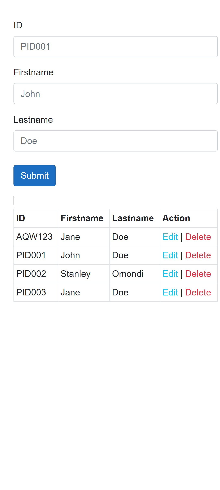

## Blazor CRUD
<p align="center">

</p>

## Description
A simple Blazor app that performs Create, Read, Update, Delete operations whilst persisting changes to MySQL/MariaDB database.

    Features:
        * Create record in database.
        * Read and display records from database.
        * Edit details for record already created in database.
        * Delete record from database.
        * Updates without page reload.

## Installation
* 1 : Clone repository **`git clone https://github.com/brienjuma/BlazorApp.git**, or downloading ZIP file of the code.
* 2 : Navigate inside project
    ```bash
    cd BlazorApp1
    ```
* 3 : Restore dependencies
    ```bash
    dotnet restore
    ```
* 4 : Create local database with provided SQL statements at <a href="./database.txt">database</a>
.
* 5 : Replace environment specific details in appsettings.json
    ```json
    {
      "ConnectionStrings": {
        "DefaultConnection": "Server={Server};Port={Port};Database={Database};User={User};Password={Password};"
      }
    }
    ```
* 6 : Build application
    ```bash
    dotnet build
    ```
* 7: Run application
    ```bash
    dotnet run
    ```
* 8: Access the App: Open a web browser and navigate to port specified in your terminal example `https://localhost:{port}` to view running Blazor app.

## Built With
* Blazor - web framework for building client applications with C#, HTML and CSS.
* BOOTSTRAP - CSS framework.
* MariaDB/MySQL - database.